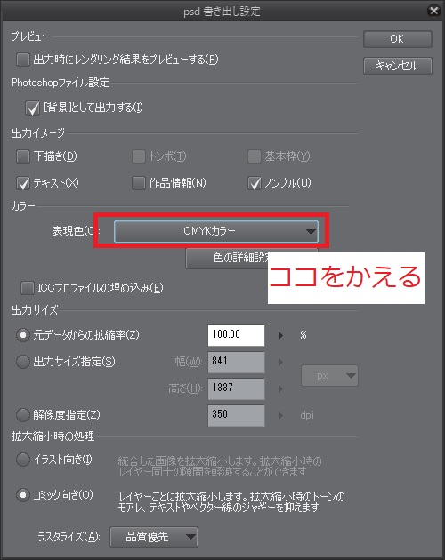

# 東方花札風イラスト合同第二弾『百花蒐集』 提出要項

## 更新履歴

* 2018-05-23: ページを作成しました。
* 2018-05-23: 配置表へのリンクを追加しました
* 2018-06-01: Q&Aを追加しました
* 2018-08-01: 提出についての更新をしました。
* 2018-08-01: Q&Aに「提出の際は.zipやダウンロードのパスワードをかける必要はあるか」を追加しました。
* 2018-08-01: 「提出について」 を 提出ミスをへらすために少し丁寧にしました。
* 2018-08-01: 「提出について」 に 最終チェック項目を追加しました。
* 2018-08-01: 百花蒐集の残りのタスクを追加
* 2018-08-01: あとがきについてを最新版へ
* 2018-08-01: クリスタのCMYK変換についてのQ&Aを追加しました

## 百花蒐集の残りのタスク

1. 原稿提出締め切り(2018/09/01)
1. あとがき締切(2018/09/03)
1. 花札合同受け渡しフォーム作成(紅楼夢・郵送) (2018/09/??)

## 概要

締切は9月1日です

* 東方キャラと、担当する花札に書いてあるものを描く
* 名刺サイズ(91mmx55mm, 350dpi)で塗り足し3mm
* 枠線は2mm(枠の有無は参加者様の判断に任せます)
* フルカラー(CMYK)
* 詳細についてはテンプレートを参照してください。
* [配置表](https://docs.google.com/spreadsheets/d/1gYfzvGhg8MBPD89yeqiY9Gs9Z6PhreumBPDPqhM7s54/edit#gid=0)

## イラストのデザインについて

ルールとしては、[割り当てられた東方のキャラクターと花札に描いてある内容](https://docs.google.com/spreadsheets/d/1gYfzvGhg8MBPD89yeqiY9Gs9Z6PhreumBPDPqhM7s54/edit#gid=0)を書いていただければ何をしていただいても構いません。

従来の花札路線のアレンジを加えても構いませんし、リアルな動物や花を描いていただいても構いませんし、独自のデフォルメをしていただいても構いません。

既存の花札等のトレース行為は著作権が危なそうなので申し訳ありませんが禁止とさせていただきます(商業利用可能でトレースしてもいいと明記されている素材についてはこの限りではありません。)。

[前回の合同](http://kurenaif.html.xdomain.jp/hanahudafugd/) を参考にしていただけるとイメージしやすいと思います。

## テンプレートについて

最終的にはテンプレートにハメて提出していただきます。
[テンプレートはココをクリックしてダウンロードしてください。](./template.psd)

**注意: 今回は、小さな名刺サイズの中で、皆様のイラストをより大きく描いていただきたいため、枠なしでも構いません。もし、枠をつけたい場合は枠の幅を統一したいため、テンプレートの「枠」をご使用ください。**

また、枠の色の変更、枠の上にイラストを描いてもOKです(前回の合同の菖蒲に八橋、芒に月がそれに対応しています。)。幅を変えない範囲でご自由にお使いください。

## あとがきについて

スパム防止のため、ここにはURLは貼れません。
皆様にURLを共有しているので、あとがきフォームから入力をよろしくおねがいします。

~~あとがきは、現在調整中です。決まり次第、お知らせいたします。~~

[前回の合同](http://kurenaif.html.xdomain.jp/hanahudafugd/)では、フライヤー(A4両面一枚)を作成して頒布しました。

~~今回は人数が多いので、予算が確保できれば小冊子を作る方針で考えています。出来なければ前回の合同と同様にフライヤーで皆様のtwitterやpixiv,ホームページなどと、イラストの対応付けをさせていただきます。~~

今年はA6サイズの本をあとがきとします！ 1ページ1月、4人ずつのあとがきを掲載する予定です。

## 提出について

提出に関して、以下のような流れでよろしくおねがいします。
ファイル名はこちらで変更するので適当で構いません。

1. 原稿を作成する
1. テンプレートとサイズが一致しているか確認する。(841px x 1137px)
1. CMYK変換する ([Q. クリスタでCMYKで保存できない](#clip_cmyk))
1. 画像を結合し、レイヤーを1枚にする
1. .psdファイルに保存する
1. DropboxやGoogle Drive, データ便などを用いて、ファイルをアップロードし、ダウンロードできるURLを取得する(ダウンロードまで3日程度猶予をください。)
1. あとがきフォーム(別にDMで送信)でURLとあとがきの内容を伝える
1. 主催のPCがトラブる可能性があるので、.psdファイルは大切に保管しておいてください。

### 最終チェック項目

* [ ] キャンバスサイズは `841px x 1137px` になっていますか？
* [ ] CMYK変換をしていますか？
* [ ] レイヤーは1枚になっていますか？

準備ができましたら、コチラまで: [@fkurenai](https://twitter.com/fkurenai)

あとがきフォームのURLはは個人のメッセージを確認してください

## 提出後のイラスト投稿、作業配信について

イラストの投稿や作業配信について一切制限を設けません。
特になにかを隠して配信する必要もありませんし、イベントより前にフルサイズのイラストを投稿していただいても構いません。サイズを縮小して投稿したり、一部を切り取って投稿する必要もありません。進捗状況をSNSにあげていただいても構いません。

もしよろしければ、配信やイラスト投稿の際に「東方花札風イラスト合同」、「百花蒐集」のタグを入れていただければ幸いです。

## 提出が遅れそうな場合、提出が難しくなってしまった場合について

合同誌のトラブルとして、提出が遅れそうな場合や、提出ができない場合がございます。

そのようなケースになった場合、可能な限り早めに連絡していただければと思います。

遅れたり提出ができないような状況で、時間を作ることは難しいと思いますがご一報いただけると幸いです。可能な限りのサポート・対応をとらせていただきます。

少し提出時期が早いように見えるかもしれませんが、パッケージングは自分の手で行う予定です。
参加者の皆様には一人2部ずつ配る予定なので、最低100部は刷らせていただきます。48枚を100部刷ると4800枚パッケージングすることになり、またミスなくするよう何重にもチェックをするので相当時間のかかる作業となっております。実際には、他の方に頒布するためにさらに量を刷る予定です。

何卒提出期限の厳守にご協力いただけたらと思います。

## Q&A

### Q. 短冊は短冊そのものではなく他の四角いもので代用してもよいか

A. かまいません。 東風谷早苗のおはらい棒や芳香の札等も可能です
「赤短(1月2月3月の短冊)」と「青短(6月9月10月の短冊)」に関しては「赤短」や「青短」という役があるので、色を赤や青にあわせていただけると嬉しいです。

### Q. ラフの提出は必要？

A. 人に見せるためのラフを描くのはとてもつらい作業なので不要です。 完成品のみの提出でOKです。

### Q. 提出の際は.zipやダウンロードのパスワードをかける必要はあるか

強制はいたしませんが、念の為パスワードをかけることを推奨とします。
パスワードのかけ方として、

* ダウンロードする際のパスワードは推奨
* .zipファイルのパスワードは不要

とさせていただきます。
あとがきフォームから(URL提出ではなく)直接ファイルを提出される方は、他の人には見えないはずなので
パスワードは気にしなくて構いません。

### Q. クリスタでCMYK変換した結果が保存されない

以前の合同でもしばしば起きた症状です。

CMYK変換をして、確認して保存したはずなのに保存するとRGB形式になっている場合、保秘方法(書き出し方法)が間違えている可能性があります。

CMYKでプレビューしたあと、ファイル(F)->画像を統合して書き出し->psd(Photoshopドキュメント)->ファイル名をつける->表現色をCMYKに変更する->OK

これで一度保存していただけないでしょうか？

詳しい図付きの説明は[CMYKデータを作る-カラープロファイル実践編-](https://howto.clip-studio.com/library/page/view/clipstudiopaint_tora_001_003)を参照してください。

それでもわからない場合は主催にご相談ください。
どうしても無理な場合は、こちらでCMYK変換をさせていただきます。

## 質問・不備等

お手数をおかけしますが、[@fkurenai](https://twitter.com/fkurenai)までDMやリプライ、メールなどでお知らせください。